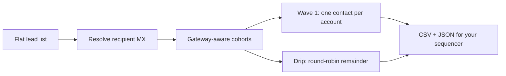

# gtm-deliverability

<!-- portfolio-status -->
**Status:** Production-derived open-source core — extracted from a private production GTM system; tenant data, provider adapters, and company-specific policy stay private. · **Layer:** Channel infrastructure · **[Portfolio map ›](https://github.com/kkrlstrm)**

> **Recipient-side campaign control for cold email.**
> Classify the mail infrastructure behind each recipient, isolate gateway cohorts, and
> throttle account exposure before launch. Export a reviewable rollout plan to the
> sequencer you already use; this tool never sends on your behalf.



Most outbound tools manage the infrastructure **sending** your email — sending
accounts, domains, daily volume, warmup, cadence. Almost none account for the
infrastructure **receiving** it.

But a list routed through Proofpoint, Mimecast, Barracuda, Microsoft 365 and Google
Workspace should not be launched as one homogeneous campaign. Each receiving
environment filters differently, and account-heavy lists carry a second, independent
risk: contacting several people at the same company in a short window can make
otherwise reasonable outreach *resemble a coordinated blast* — regardless of which
gateway is in front.

`gtm-deliverability` turns a raw audience into a staged execution plan:

- **separate cohorts by receiving gateway**, so each can be launched, monitored, and
  sender-assigned independently;
- **place at most one contact per company** into the first wave;
- **hold the rest for a round-robin, account-level drip**, so consecutive sends hit
  different companies;
- **attach conservative cadence and sender-policy defaults** you can adapt to your own
  data;
- **export plain CSV + JSON** for the sequencer you already use.

The result is a reviewable plan, not another sender. It does not send email, verify
addresses, or promise inbox placement. It gives outbound teams **recipient-side campaign
controls before the first email is sent.**

```console
$ mailgate classify harvard.edu stanford.edu gmail.com jpmorgan.com microsoft.com
  harvard.edu    proofpoint  mx0a-00171101.pphosted.com  [PROTECTED]
  stanford.edu   proofpoint  mxa-00000d07.gslb.pphosted.com  [PROTECTED]
  gmail.com      google      gmail-smtp-in.l.google.com
  jpmorgan.com   other       cluster14.us.messagelabs.com
  microsoft.com  microsoft   microsoft-com.mail.protection.outlook.com
```

That's a live DNS lookup — no API key, no account, real MX records.

---

## The missing control plane

A sequencer sees **500 rows**. It schedules them almost entirely off sender-side knobs:
which inbox, which domain, how many per day, what warmup curve.

A recipient-aware system sees the same list as **140 companies across five receiving
environments, with concentrated account exposure and a staged expansion decision to
make.** That second view is what this tool builds — before anything is loaded into a
sequencer.

Think of it as an early **campaign compiler**: raw audience in, execution plan out,
where the plan is derived from recipient infrastructure and account-level concentration
rather than from send-rate alone.

| A sequencer sees | `gtm-deliverability` sees |
|---|---|
| 500 rows under one global send rate | 140 accounts across five receiving environments |
| Sender-side volume knobs | Gateway cohorts and account-level concentration |
| One broad launch | A Wave 1 to observe, then a deliberate Drip expansion |

## What it controls (and what it doesn't)

This is **recipient-side campaign risk**, not deliverability as a whole. Whether an
individual email reaches the inbox depends on authentication (SPF/DKIM/DMARC), domain
reputation and sending history, copy, complaint rates, list quality and engagement —
most of which live on *your* side and are out of scope here.

What this tool controls is narrower and genuinely yours to control: **how your campaign
architecture treats fundamentally different receiving environments, and how
concentrated it is within any single account.** It stops a flat list from being blasted
as though every recipient sat behind the same filter.

## Before / after

**Before** — the whole list goes into a sequencer under one global send rate. The
biggest accounts get hit several times in the opening days, the loudest cohort's
bounces are indistinguishable from the quiet one's, and by the time a receiving
environment reacts you can't tell which cohort caused it.

**After** — `mailgate segment` produces isolated, per-company-throttled **Wave 1 + Drip**
segments per gateway. You launch Wave 1, watch that cohort specifically, and only expand
into its Drip once it's clean. Each receiving environment is a separately observable,
separately haltable cohort — so expansion is a deliberate decision, not a side effect of
the send rate.

## Who it's for

Strongest fit:

- **GTM engineers** running programmatic, multi-account outbound.
- **Agencies** operating several sending domains/inboxes who need per-cohort control.
- **Teams targeting enterprise, education, government, or regulated organizations** —
  exactly where secure gateways (Proofpoint/Mimecast/Barracuda) cluster.
- **Any list with multiple contacts per account**, where concentration is the real risk.
- Operators who already have verification + sending infrastructure but lack
  **campaign-level** risk controls.

Probably overkill for a solo founder emailing one person at each 50-person startup —
one contact per company, mostly Google/Microsoft, little to stage.

## Install from source

```bash
git clone https://github.com/kkrlstrm/gtm-deliverability
cd gtm-deliverability && pip install -e .
```

Requires Python 3.9+ and `dnspython`. No API keys, no account, no network calls beyond
public DNS.

## Quickstart

**1. Classify a few domains** (sanity check, no CSV needed):

```bash
mailgate classify districtname.org anotherdistrict.k12.us --json
```

**2. Segment a lead CSV.** Only an `email` column is required; a `company` column
enables the per-company throttle; **every other column rides through untouched** (your
subjects, bodies, personas, whatever):

```bash
mailgate segment leads.csv --name "WI K-12 Q3"
```

```text
================================================================
SEGMENTATION — gateway distribution & planned segments
================================================================
leads classified: 480

by receiving gateway:
  Proofpoint    212  (wave1=140, drip=72, companies=140)  [PROTECTED]
  Mimecast       64  (wave1=51,  drip=13, companies=51)   [PROTECTED]
  Barracuda      33  (wave1=30,  drip=3,  companies=30)   [PROTECTED]
  Microsoft      98  (wave1=88,  drip=10, companies=88)
  Google         51  (wave1=49,  drip=2,  companies=49)
  Unknown        22  (wave1=22,  drip=0,  companies=22)

planned segments: 10
  • WI K-12 Q3 · Proofpoint · Wave 1
      140 leads / 140 companies · 5-day gaps · senders microsoft_only
  • WI K-12 Q3 · Proofpoint · Drip
      72 leads / 68 companies · 5-day gaps · senders microsoft_only, drip 5/day
  ...
```

You get, in `./seg_<name>/`:

| File | What it is |
|---|---|
| `<gateway>_wave1.csv` | One contact per company, per gateway — launch these first |
| `<gateway>_drip.csv` | The rest, round-robined across companies — start after Wave 1 is clean |
| `mx_audit.csv` | Every domain → its gateway, MX host, and contact count |
| `manifest.json` | The full plan: cohorts, cadence, sender policy, counts |

Each segment CSV keeps your original columns **plus** `mx_provider` / `mx_host` /
`mx_error`. Load them into your sequencer in order: **Wave 1 first, watch that cohort,
then the matching Drip.** That sequencing is where the throttle actually happens — see
[Gateway isolation](#gateway-isolation-what-the-split-actually-buys).

## How gateway classification works

For each recipient domain it resolves the MX records over public nameservers
(`1.1.1.1` / `8.8.8.8`, so results don't depend on your local DNS) and matches the MX
hostnames against known gateway fingerprints. Buckets:

| Bucket | Meaning |
|---|---|
| `proofpoint` / `mimecast` / `barracuda` | Protected secure gateways — the hard-to-reach ones |
| `microsoft` / `google` | The big hosted mail platforms |
| `other` | MX resolved but matched no known fingerprint |
| `unknown` | NXDOMAIN / no MX / timeout / malformed — **never guessed into a gateway** |

**A protected gateway wins even when Microsoft or Google is the lowest-preference MX**,
because the gateway is what screens inbound — a school can run Microsoft 365 behind
Proofpoint. Classification is deterministic and cached per domain
(`~/.cache/gtm-deliverability/mx_cache.json`), so re-runs on the same list are near-
instant — real lists cluster on a handful of domains. The fingerprint list in
[`mailgate/classify.py`](mailgate/classify.py) is a plain table; add your own in a line.

## The wave / drip model

Within each gateway cohort:

- **Wave 1** = at most **one contact per company**. Which contact is chosen is a stable
  hash of the email, so the plan is fully reproducible.
- **Drip** = everyone else, **round-robined across companies** so consecutive daily adds
  hit different companies. Recommended `5` new contacts/day (`--drip-per-day`).
- **Sender policy** per gateway is carried in the manifest as metadata, not enforced
  here (see below).
- **Role inboxes** (`info@`, `board@`, …) are counted per cohort — they behave
  differently and often route straight to a quarantine.

## Gateway isolation — what the split actually buys

Be precise about this: **splitting the list by gateway does not by itself create
separate sending reputations.** If you send every cohort from the same domains and
inboxes, the reputation those domains earn is still shared.

What the split gives you is **operational control**:

- **independent launch** — start one cohort without committing the others;
- **separate monitoring** — a Proofpoint cohort's bounce rate isn't averaged into a
  Google one;
- **per-cohort sender assignment** — point different sending domains/inboxes at
  different cohorts *if you have them*;
- **haltable expansion** — stop drilling into a cohort that's reacting badly without
  touching the rest;
- **clean attribution** — when one receiving environment behaves differently, you can
  see it and act on it.

The reputation benefit is real but *indirect*: it comes from the controlled, observable
rollout the split enables, not from the CSV boundaries themselves.

## Defaults vs. guarantees

The cadence (5-day gaps), drip rate (5/day), Wave-1-is-one-per-company rule, and the
`microsoft_only` / `microsoft_preferred` sender policies are **opinionated, conservative
defaults — not deliverability laws.** They encode a single posture: *don't concentrate,
expand slowly, and prefer the most trusted path into a protected gateway.*

For example, protected gateways get a stricter default (`microsoft_only`) because
Microsoft-to-Microsoft is often a comparatively trusted path — but that's a heuristic to
adapt to your own sending data, not a universal rule. Filtering and reputation decisions
at these gateways draw on global vendor intelligence, per-tenant configuration,
recipient-domain policy, and engagement signals you don't control. Treat every default
here as a starting policy: they're all flags (`--gap-days`, `--drip-per-day`,
`--company-key`, …).

## Bring your own sequencer

The output is plain CSV + JSON. Point it at Instantly, Smartlead, Lemlist, Email Bison,
HubSpot sequences, or your own SMTP loop. `gtm-deliverability` owns the *decision* of
who to send to and when; your sequencer owns the send. That boundary is deliberate: adopt
recipient-side controls without migrating your sending stack.

## Scope & limitations

- **It doesn't send, warm up inboxes, or write copy.** It's the pre-send planning layer,
  not an ESP.
- **It doesn't verify addresses or predict inbox placement.** Run your bounce-checker
  first; feed it clean emails.
- **It doesn't create sending reputation.** It gives you the control surface to manage
  reputation deliberately (see [Gateway isolation](#gateway-isolation-what-the-split-actually-buys)).
- **Compliance is yours.** Cold outreach carries CAN-SPAM and, for government/regulated
  recipients, additional obligations. This tool makes your *campaign architecture* safer;
  it does not make a list legal to email.

## CLI reference

```
mailgate classify <emails-or-domains...> [--file F] [--json] [--refresh] [--no-cache] [--ttl-days N]
mailgate segment  <leads.csv> -n "<name>"
                  [--company-key company|domain|company_or_domain]
                  [--gap-days 5] [--first-wait 1] [--drip-per-day 5]
                  [--exclude-unknown] [--out-dir DIR]
                  [--refresh-mx] [--mx-ttl-days 30] [--mx-qps 5]
```

## Testing

The whole suite runs offline — classification takes an injectable resolver, so tests
inject a fake and never touch the network:

```bash
pip install -e ".[dev]"
pytest -q
```

## License

Apache 2.0 — see [LICENSE](LICENSE).

---

<!-- portfolio-footer -->
## Where this fits

Part of a portfolio of **governed, AI-native GTM systems** — production-derived
open-source cores and reusable patterns extracted from a private production stack. In
that system this is the recipient-side pre-send control plane the list passes through
before it's launched.

**Full portfolio map → [github.com/kkrlstrm](https://github.com/kkrlstrm)**

Works with:
- [gtm-pipeline](https://github.com/kkrlstrm/gtm-pipeline) — produces the list this stages
